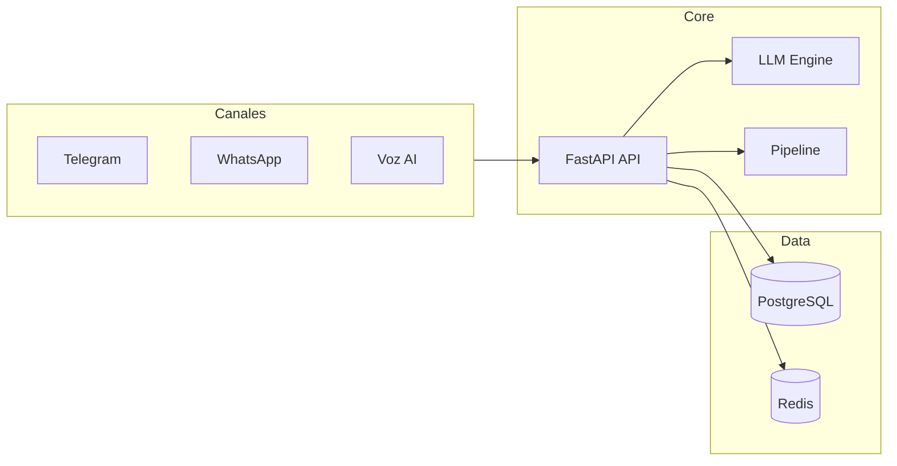

# AI Lead Agent Pro

CRM inmobiliario multi-tenant con inteligencia artificial para calificación de leads, comunicación multicanal (Telegram, WhatsApp, voz), pipeline de ventas automatizado y campañas de marketing.

## Tabla de Contenidos

| Sección | Descripción |
|---------|-------------|
| [Arquitectura](architecture/overview.md) | Descripción de la arquitectura general del sistema |
| [Multi-Agente](architecture/multi_agent.md) | Sistema multi-agente especializado (Qualifier, Scheduler, FollowUp) |
| [Diagramas](architecture/diagrams.md) | Diagramas de arquitectura, ERD, flujo de datos y componentes |
| [Decisiones](architecture/decisions.md) | Architecture Decision Records (ADRs) |
| [Requerimientos Funcionales](requirements/functional.md) | Funcionalidades del sistema |
| [Requerimientos No Funcionales](requirements/non-functional.md) | Rendimiento, seguridad, escalabilidad |
| [Casos de Uso](use-cases/overview.md) | Listado y detalle de casos de uso |
| [API - Overview](api/overview.md) | Descripción general de la API REST |
| [API - Endpoints](api/endpoints.md) | Documentación detallada de endpoints |
| [API - Webhooks](api/webhooks.md) | Payloads de webhooks (Telegram, WhatsApp, VAPI) |
| [Guía de Inicio](guides/getting-started.md) | Instalación y configuración |
| [Guía de Desarrollo](guides/development.md) | Guía para desarrolladores |
| [Guía de Despliegue](guides/deployment.md) | Despliegue en producción |
| [Estrategia de Testing](testing/strategy.md) | Plan y cobertura de pruebas |
| [Eval Baseline](testing/eval_baseline.md) | Baselines de calidad del agente IA |
| [Roadmap](status/ROADMAP_PROGRESS.md) | Estado de sprints y pendientes |
| [Changelog](changelog/CHANGELOG.md) | Historial de versiones |

## Stack Tecnológico

| Capa | Tecnología |
|------|-----------|
| Backend | FastAPI (Python 3.11+), async/await |
| Frontend | React + Vite, Zustand |
| Base de Datos | PostgreSQL 15 + pgvector + SQLAlchemy 2.0 (async) |
| Cache | Redis (sesiones, semántico, DLQ, prompt cache) |
| Colas | Celery + Redis (con Dead Letter Queue) |
| LLM | Gemini, Claude, OpenAI (Strategy + Router de failover) |
| Agente IA | Sistema multi-agente: QualifierAgent, SchedulerAgent, FollowUpAgent |
| Herramientas IA | MCP Server (Model Context Protocol) |
| RAG | pgvector + Gemini embeddings |
| Eval | deepeval + métricas deterministas custom |
| Voz | VAPI, Bland AI (Strategy Pattern) |
| Chat | Telegram, WhatsApp (Strategy Pattern) |
| Calendario | Google Calendar API |
| Tiempo Real | WebSocket por broker |
| Auth | JWT + bcrypt |
| Infraestructura | Docker Compose |

## Arquitectura en Resumen

El sistema es una aplicación multi-tenant donde cada **Broker** (inmobiliaria) tiene su propia configuración de IA, pipeline de ventas y canales de comunicación. Los **Leads** se califican automáticamente mediante LLM y se mueven a través de un pipeline de ventas con campañas automatizadas.

