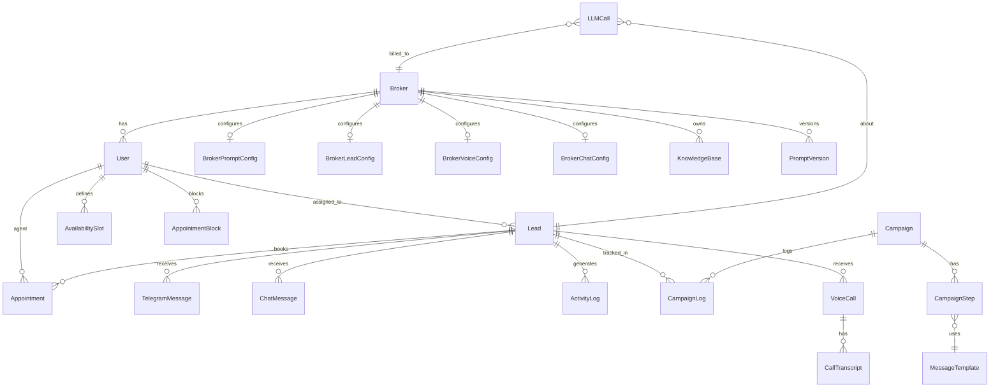

# Database Schema

PostgreSQL 15 with the `pgvector` extension. All tables use an integer primary key (`id`), `created_at`, and `updated_at` timestamps inherited from `Base + IdMixin + TimestampMixin`.

## Entity Relationship Diagram

## Tables

### `brokers`
| Column | Type | Notes |
|---|---|---|
| id | Integer PK | |
| name | String(200) | NOT NULL |
| slug | String(100) | UNIQUE, indexed |
| phone | String(50) | |
| email | String(200) | |
| logo_url | String(500) | |
| website | String(500) | |
| address | Text | |
| timezone | String(50) | |
| currency | String(10) | |
| country | String(50) | |
| language | String(10) | |
| subscription_plan | String(50) | |
| is_active | Boolean | default `true` |
| created_at / updated_at | DateTime TZ | via TimestampMixin |

### `users`
| Column | Type | Notes |
|---|---|---|
| id | Integer PK | |
| email | String(100) | UNIQUE NOT NULL |
| hashed_password | String(255) | bcrypt |
| name | String(100) | NOT NULL |
| role | Enum | `SUPERADMIN` \| `ADMIN` \| `AGENT` |
| broker_id | FK → brokers | NULL for SUPERADMIN |
| is_active | Boolean | default `true` |

### `leads`
| Column | Type | Notes |
|---|---|---|
| id | Integer PK | |
| phone | String(20) | NOT NULL, indexed. Duplicates allowed. |
| name | String(100) | nullable |
| email | String(100) | nullable |
| status | String(20) | `cold`\|`warm`\|`hot`\|`converted`\|`lost` |
| lead_score | Float | 0–100, indexed |
| lead_score_components | JSON | `{base, behavior, engagement}` |
| last_contacted | DateTime TZ | indexed |
| pipeline_stage | String(50) | `entrada`\|`perfilamiento`\|`calificacion_financiera`\|`agendado`\|`seguimiento`\|`referidos`\|`ganado`\|`perdido` |
| stage_entered_at | DateTime TZ | indexed |
| campaign_history | JSON | list of `{campaign_id, applied_at, steps_completed}` |
| assigned_to | FK → users | SET NULL on delete |
| broker_id | FK → brokers | CASCADE on delete |
| treatment_type | Enum | `automated_telegram`\|`automated_call`\|`manual_follow_up`\|`hold` |
| next_action_at | DateTime TZ | indexed |
| notes | Text | internal agent notes |
| tags | JSON | string array |
| metadata (lead_metadata) | JSON | `{budget, location, timeline, calificacion, ...}` |

**Composite indexes:** `(status, lead_score)`, `(pipeline_stage, stage_entered_at)`, `(assigned_to, treatment_type)`, `(next_action_at, treatment_type)`

### `appointments`
| Column | Type | Notes |
|---|---|---|
| lead_id | FK → leads | CASCADE |
| agent_id | FK → users | SET NULL |
| appointment_type | Enum | `property_visit`\|`virtual_meeting`\|`phone_call`\|`office_meeting`\|`other` |
| status | Enum | `scheduled`\|`confirmed`\|`cancelled`\|`completed`\|`no_show` |
| start_time / end_time | DateTime TZ | |
| duration_minutes | Integer | default 60 |
| location | String(500) | address or virtual link |
| meet_url | String(500) | Google Meet URL |
| google_event_id | String(255) | Calendar event ID |
| reminder_sent_24h / reminder_sent_1h | Boolean | |
| cancelled_at | DateTime TZ | |
| cancellation_reason | Text | |

### `campaigns` / `campaign_steps` / `campaign_logs`
**Campaign channels:** `telegram` \| `call` \| `whatsapp` \| `email`  
**Step actions:** `send_message` \| `make_call` \| `schedule_meeting` \| `update_stage`  
**Triggers:** `manual` \| `lead_score` \| `stage_change` \| `inactivity`

### `knowledge_base`
| Column | Type | Notes |
|---|---|---|
| broker_id | FK → brokers | CASCADE |
| title | String(255) | |
| content | Text | text that was embedded |
| embedding | Vector(768) | Gemini text-embedding-004 |
| source_type | String(50) | `property`\|`faq`\|`policy`\|`subsidy`\|`custom` |
| metadata | JSONB | price, location, bedrooms, etc. |

**Index:** IVFFlat cosine (`lists=100`) on `embedding`.

### `llm_calls`
Records every LLM API round-trip: `provider`, `model`, `call_type`, `input_tokens`, `output_tokens`, `estimated_cost_usd`, `latency_ms`, `error`, `used_fallback`.

### `voice_calls` / `call_transcripts`
`VoiceCall` stores call metadata, recording URL, AI summary, `score_delta`, and `stage_after_call`. `CallTranscript` stores per-line transcription with `speaker` (`bot`\|`customer`), timestamp offset, and STT `confidence`.
