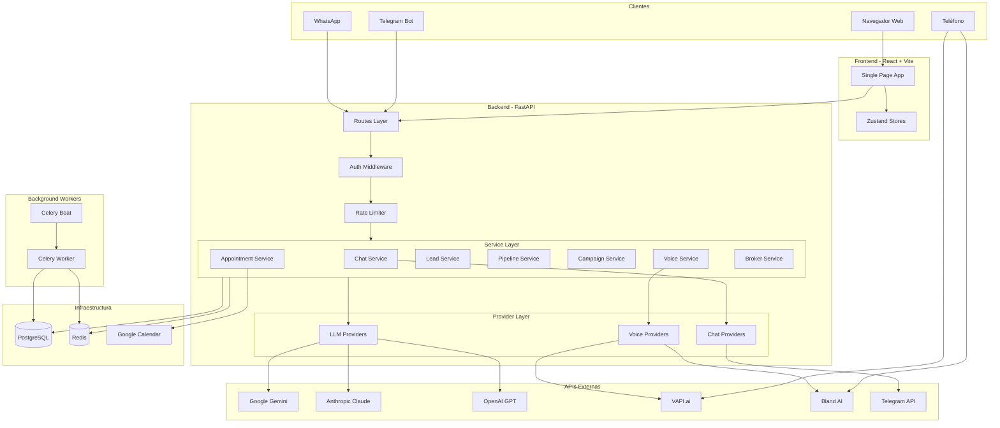
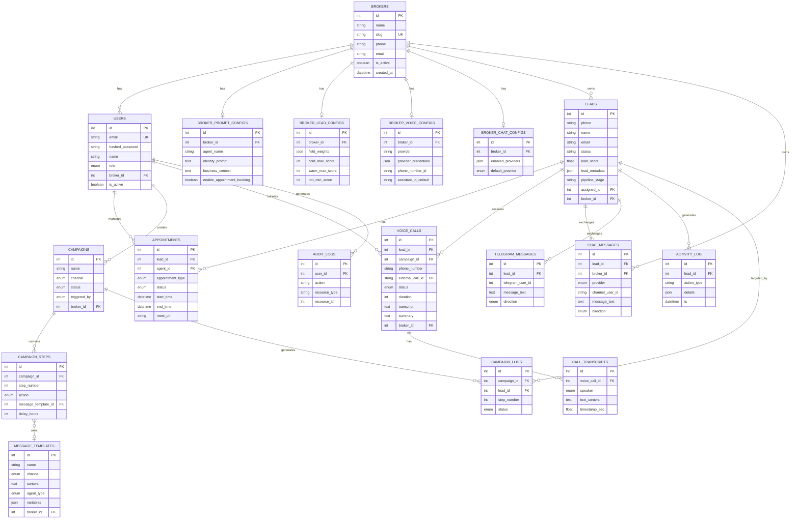
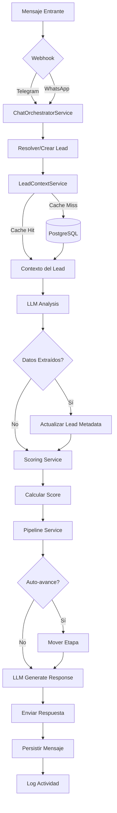
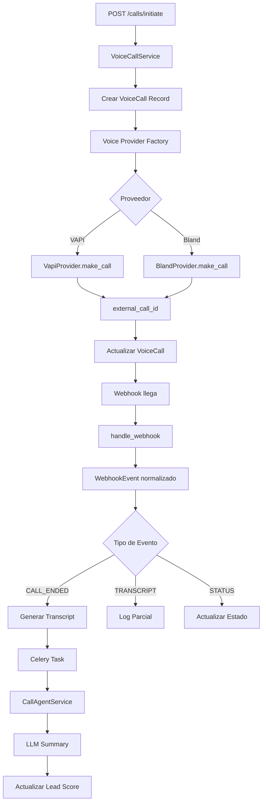
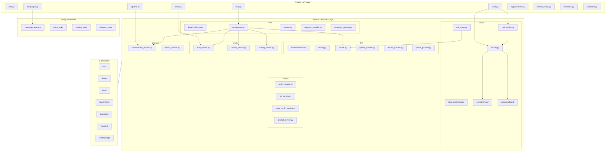

# Diagramas de Arquitectura

## 1. Diagrama de Arquitectura del Sistema

## 2. Diagrama de Base de Datos (ERD)

## 3. Diagrama de Flujo de Datos

### Flujo de Mensaje de Chat

### Flujo de Llamada de Voz

## 4. Diagrama de Componentes

