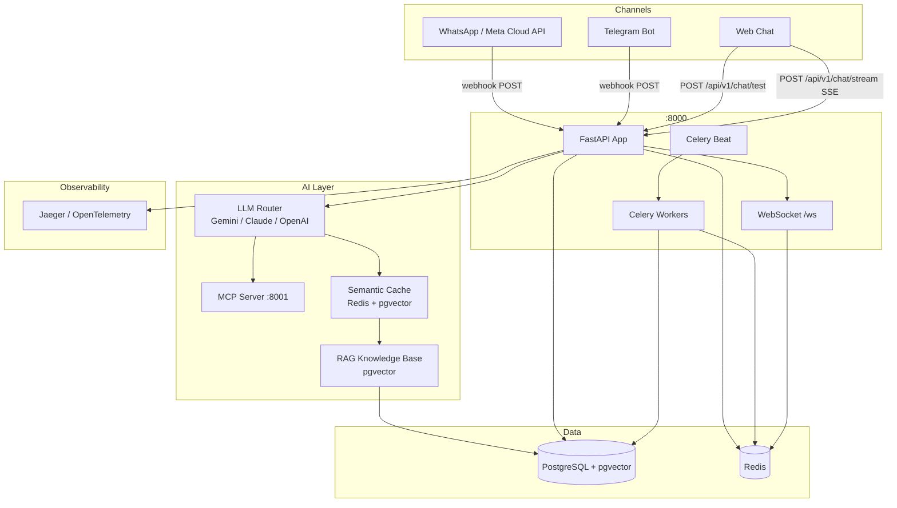

# System Architecture Overview

## Summary

**AI Lead Agent Pro** is a multi-tenant real-estate CRM powered by an AI agent named **Sofía**. The system qualifies inbound leads via WhatsApp, Telegram, and web chat, managing the full lifecycle from first contact through appointment booking.

## High-Level Architecture

## Technology Stack

| Layer | Technology |
|---|---|
| API Framework | FastAPI (async) |
| ORM | SQLAlchemy 2 async |
| Database | PostgreSQL 15 + pgvector extension |
| Cache / Broker | Redis 7 |
| Task Queue | Celery + Celery Beat |
| LLM Providers | Google Gemini 2.5 Flash (primary), Anthropic Claude Sonnet (fallback), OpenAI GPT-4o |
| AI Tools Protocol | MCP 1.2.0 (HTTP transport) |
| Voice Calls | VAPI.ai |
| Messaging | Telegram Bot API, WhatsApp Meta Cloud API |
| Embeddings | Gemini text-embedding-004 (768 dims) |
| Tracing | OpenTelemetry + Jaeger |
| Frontend | React 18, Vite, Tailwind CSS, Zustand, React Router v6 |

## Layers

### 1. Inbound Channels
Leads arrive via Telegram webhook (`POST /webhooks/telegram`), WhatsApp webhook (`POST /webhooks/whatsapp`), or the web chat endpoint (`POST /api/v1/chat/test`). Webhook payloads are validated and dispatched to `ChatOrchestratorService`.

### 2. FastAPI Application
All HTTP and WebSocket traffic is handled by a single FastAPI app (`backend/app/main.py`). Routers are registered with versioned prefixes (e.g. `/api/v1/leads`). Middleware stack: `RequestIDMiddleware` → `CORSMiddleware` → `TrustedHostMiddleware` → `RateLimitMiddleware` (production only).

### 3. AI / LLM Layer
- **LLM Router** selects the active provider from `settings.LLM_PROVIDER` and falls back to `settings.LLM_FALLBACK_PROVIDER` on failure, controlled by circuit breakers (`pybreaker`).
- **MCP Server** exposes tools (appointment booking, lead update, KB search) over HTTP transport on port 8001.
- **Semantic Cache** stores recent embeddings in Redis; hits bypass LLM calls when cosine similarity ≥ `SEMANTIC_CACHE_THRESHOLD` (default `0.92`).
- **RAG KB** queries `knowledge_base` table via IVFFlat cosine index to inject broker-specific property/FAQ context into the system prompt.

### 4. Background Tasks
Celery workers handle campaign step execution, voice call initiation, reminder sending, and DLQ retries. Celery Beat schedules recurring jobs (pipeline auto-advance, inactivity triggers).

### 5. Real-Time Updates
WebSocket endpoint `WS /ws/{broker_id}/{user_id}` broadcasts events (`new_message`, `stage_changed`, `lead_assigned`, `lead_hot`) to connected CRM dashboard clients. Authentication uses a JWT sent as the first WebSocket frame.

## Multi-Tenancy Model

Every resource (`Lead`, `Campaign`, `KnowledgeBase`, `PromptConfig`) is scoped to a `broker_id`. Role-based access (`AGENT` / `ADMIN` / `SUPERADMIN`) is enforced at the route layer via `Permissions` middleware.
