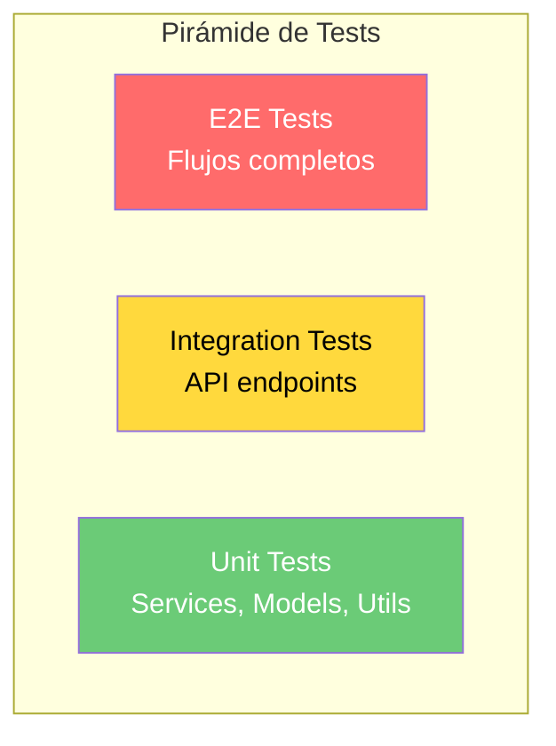

# Estrategia de Testing

## Visión General

| Nivel | Herramienta | Cobertura Actual | Objetivo |
|-------|------------|-----------------|----------|
| Unit Tests | pytest + pytest-asyncio | Buena (agentes, voz, auth) | 80% servicios |
| Eval Tests | deepeval + métricas custom | 51 conversaciones, 26 tests | Regresión de calidad |
| Integration Tests | pytest + httpx | Parcial | 60% rutas |
| E2E Tests | [TODO: Playwright/Cypress] | Ninguna | Flujos críticos |

## Pirámide de Tests



## Tests Existentes

### Unit Tests de Servicios

| Archivo | Cobertura |
|---------|-----------|
| `tests/services/test_voice_providers.py` | Providers de voz, factory, webhook handling |
| `tests/test_auth.py` | Autenticación y JWT |
| `tests/test_chat.py` | Servicio de chat |

### Test de Voice Providers

Tests implementados en `tests/services/test_voice_providers.py`:

| Test | Descripción |
|------|-------------|
| `test_voice_provider_type_enum` | Verifica valores del enum VoiceProviderType |
| `test_webhook_event_dataclass` | Verifica estructura de WebhookEvent |
| `test_make_call_request_defaults` | Verifica defaults de MakeCallRequest |
| `test_get_voice_provider_vapi` | Factory retorna VapiProvider |
| `test_get_voice_provider_bland` | Factory retorna BlandProvider |
| `test_get_voice_provider_default` | Provider por defecto es VAPI |
| `test_vapi_webhook_normalization` | Normalización de webhooks VAPI |
| `test_bland_webhook_normalization` | Normalización de webhooks Bland |
| `test_webhook_event_to_legacy` | Conversión a formato legacy |

## Ejecución

```bash
cd backend

# Instalar dependencias de test
pip install -r requirements-test.txt

# Todos los tests
pytest -v

# Solo un módulo
pytest tests/services/test_voice_providers.py -v

# Con cobertura
pytest --cov=app --cov-report=html --cov-report=term-missing

# Solo tests async
pytest -m asyncio -v
```

## Configuración

### conftest.py

El archivo `tests/conftest.py` provee fixtures comunes:

- Base de datos de test (SQLite in-memory o PostgreSQL de test)
- Sesión async de SQLAlchemy
- Cliente HTTP de test (httpx)
- Fixtures de datos (broker, user, lead de prueba)

### Markers

| Marker | Descripción |
|--------|-------------|
| `@pytest.mark.asyncio` | Tests asíncronos |
| `@pytest.mark.integration` | Tests de integración (requiere BD) |
| `@pytest.mark.slow` | Tests lentos (LLM, API externas) |

## Plan de Cobertura

### Prioridad Alta

| Módulo | Tests Necesarios |
|--------|-----------------|
| `services/leads/scoring_service.py` | Cálculo de scores, clasificación |
| `services/pipeline/advancement_service.py` | Auto-avance de etapas |
| `services/chat/orchestrator.py` | Flujo completo de mensaje |
| `routes/auth.py` | Registro, login, permisos |
| `middleware/auth.py` | JWT validation, role checks |

### Prioridad Media

| Módulo | Tests Necesarios |
|--------|-----------------|
| `services/appointments/service.py` | CRUD, disponibilidad, calendario |
| `services/campaigns/service.py` | Triggers, ejecución de steps |
| `routes/leads.py` | CRUD, filtros, bulk import |
| `services/broker/config_service.py` | Config CRUD, defaults |

### Prioridad Baja

| Módulo | Tests Necesarios |
|--------|-----------------|
| `services/shared/template_service.py` | Renderizado de variables |
| `services/shared/activity_service.py` | Logging de actividades |
| `tasks/` | Ejecución de tareas Celery |

## Mocking

Para tests unitarios, mockear:

| Dependencia | Estrategia |
|-------------|-----------|
| Base de datos | SQLite in-memory o mock de session |
| Redis | `fakeredis` o mock |
| APIs externas (LLM, VAPI) | `unittest.mock.AsyncMock` |
| Google Calendar | Mock de `googleapiclient` |
| Telegram | Mock de `python-telegram-bot` |

## CI/CD

[TODO: Configurar pipeline de CI/CD]

```yaml
# Ejemplo de GitHub Actions
name: Tests
on: [push, pull_request]
jobs:
  test:
    runs-on: ubuntu-latest
    services:
      postgres:
        image: postgres:15
      redis:
        image: redis:7
    steps:
      - uses: actions/checkout@v4
      - uses: actions/setup-python@v5
        with:
          python-version: '3.11'
      - run: pip install -r backend/requirements.txt -r backend/requirements-test.txt
      - run: cd backend && pytest --cov=app
```
