# Casos de Uso

## Actores

| Actor | Descripción |
|-------|-------------|
| **Superadmin** | Administrador global del sistema. Gestiona brokers y usuarios globalmente |
| **Admin** | Administrador de un broker (inmobiliaria). Configura IA, pipeline, campañas |
| **Agent** | Agente de ventas. Ve solo sus leads asignados, gestiona citas |
| **Lead** | Prospecto/cliente potencial. Interactúa vía Telegram, WhatsApp o teléfono |
| **Sistema** | Procesos automáticos (scoring, pipeline, campañas, IA) |

## Diagrama General de Casos de Uso

```mermaid
flowchart TB
    subgraph actors [Actores]
        SA[Superadmin]
        AD[Admin]
        AG[Agent]
        LD[Lead]
        SYS[Sistema]
    end

    subgraph uc_auth [Autenticación]
        UC01[Registrar Broker]
        UC02[Login]
    end

    subgraph uc_leads [Gestión de Leads]
        UC03[Crear Lead]
        UC04[Importar Leads CSV]
        UC05[Asignar Lead a Agente]
        UC06[Ver Lead con Actividades]
    end

    subgraph uc_chat [Comunicación]
        UC07[Enviar Mensaje por Chat]
        UC08[Iniciar Llamada de Voz]
        UC09[Agendar Cita vía Chat]
    end

    subgraph uc_pipeline [Pipeline]
        UC10[Mover Lead de Etapa]
        UC11[Auto-avance de Pipeline]
    end

    subgraph uc_camp [Campañas]
        UC12[Crear Campaña]
        UC13[Ejecutar Campaña]
    end

    subgraph uc_config [Configuración]
        UC14[Configurar Prompt IA]
        UC15[Configurar Scoring]
        UC16[Configurar Voz]
    end

    SA --> UC01
    SA --> UC05
    AD --> UC03
    AD --> UC04
    AD --> UC05
    AD --> UC12
    AD --> UC14
    AD --> UC15
    AD --> UC16
    AG --> UC06
    AG --> UC08
    AG --> UC10
    LD --> UC07
    LD --> UC09
    SYS --> UC11
    SYS --> UC13
```

## Índice de Casos de Uso

| ID | Caso de Uso | Actor Principal | Archivo |
|----|-------------|-----------------|---------|
| UC-01 | [Registrar Broker](uc-01-registrar-broker.md) | Superadmin/Admin | `uc-01-registrar-broker.md` |
| UC-02 | [Login](uc-02-login.md) | Todos | `uc-02-login.md` |
| UC-03 | [Gestionar Leads](uc-03-gestionar-leads.md) | Admin/Agent | `uc-03-gestionar-leads.md` |
| UC-04 | [Enviar Mensaje por Chat](uc-04-enviar-mensaje-chat.md) | Lead | `uc-04-enviar-mensaje-chat.md` |
| UC-05 | [Iniciar Llamada de Voz](uc-05-iniciar-llamada-voz.md) | Agent/Admin | `uc-05-iniciar-llamada-voz.md` |
| UC-06 | [Crear y Ejecutar Campaña](uc-06-crear-ejecutar-campana.md) | Admin | `uc-06-crear-ejecutar-campana.md` |
| UC-07 | [Agendar Cita](uc-07-agendar-cita.md) | Agent/Lead | `uc-07-agendar-cita.md` |
| UC-08 | [Configurar Broker](uc-08-configurar-broker.md) | Admin | `uc-08-configurar-broker.md` |
