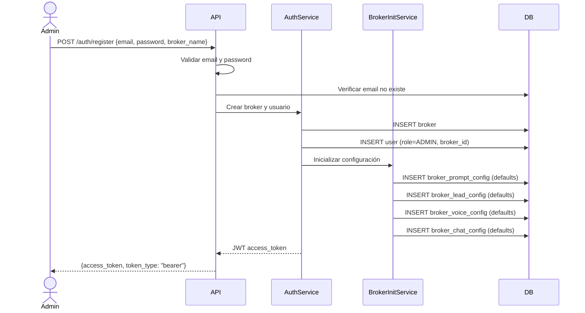

# UC-01: Registrar Broker

## Descripción

Un usuario nuevo registra una inmobiliaria (broker) en el sistema. El sistema crea automáticamente el broker, el usuario admin y las configuraciones por defecto.

## Actor Principal

Admin (nuevo)

## Precondiciones

- El email del usuario no está registrado en el sistema

## Flujo Principal

1. El usuario envía email, contraseña y nombre del broker
2. El sistema valida el email (formato) y la contraseña (min 8 chars, mayúscula, minúscula, dígito)
3. El sistema verifica que el email no está registrado
4. El sistema crea el broker con nombre y slug auto-generado
5. El sistema crea el usuario con rol ADMIN vinculado al broker
6. `BrokerInitService` crea configuraciones por defecto (prompt, scoring, voz, chat)
7. El sistema retorna un JWT access token

## Flujos Alternativos

| ID | Condición | Acción |
|----|-----------|--------|
| FA-1 | Email ya registrado | Retornar 400 "Email already registered" |
| FA-2 | Contraseña no cumple requisitos | Retornar 422 con detalle de validación |
| FA-3 | Email inválido | Retornar 422 con error de formato |

## Postcondiciones

- Broker creado con `is_active=True`
- Usuario creado con `role=ADMIN`, `is_active=True`
- Configuraciones de prompt, scoring, voz y chat creadas con valores por defecto
- JWT emitido y listo para usar
