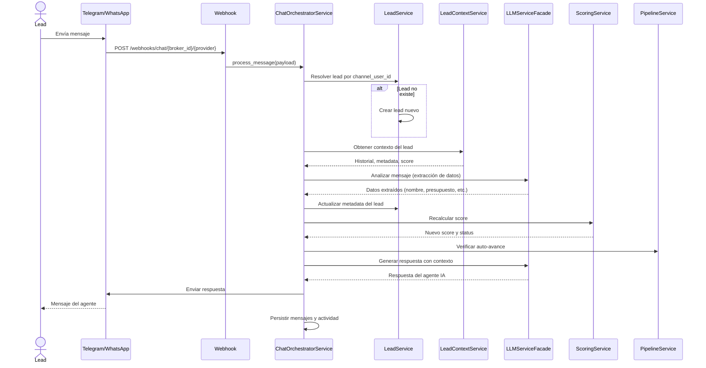

# UC-04: Enviar Mensaje por Chat

## Descripción

Un lead envía un mensaje a través de Telegram o WhatsApp. El sistema procesa el mensaje con IA, actualiza el perfil del lead y responde automáticamente.

## Actor Principal

Lead (vía canal de mensajería)

## Precondiciones

- Webhook configurado para el canal (Telegram/WhatsApp)
- Broker tiene configuración de prompt activa
- Proveedor de LLM configurado y disponible

## Flujo Principal

1. Lead envía mensaje por Telegram o WhatsApp
2. El proveedor envía webhook a `POST /webhooks/chat/{broker_id}/{provider}`
3. `ChatOrchestratorService` resuelve o crea el lead por `channel_user_id`
4. Se obtiene contexto del lead (caché Redis o BD)
5. LLM analiza el mensaje para extraer datos (nombre, ubicación, presupuesto, etc.)
6. Se actualiza la metadata del lead con datos extraídos
7. Se recalcula el score del lead
8. Se verifica si corresponde auto-avance de etapa en el pipeline
9. LLM genera respuesta personalizada usando el prompt del broker
10. Se envía la respuesta al lead por el canal original
11. Se persisten ambos mensajes y se registra actividad

## Flujos Alternativos

| ID | Condición | Acción |
|----|-----------|--------|
| FA-1 | LLM no disponible | Respuesta genérica de error temporal |
| FA-2 | Lead solicita agendar cita | Trigger function calling para agendar (UC-07) |
| FA-3 | Webhook signature inválida | Retornar 401, no procesar |

## Postcondiciones

- Mensajes (entrante y saliente) persistidos en `chat_messages`
- Metadata del lead actualizada con datos extraídos
- Score recalculado
- Pipeline evaluado para auto-avance
- Actividad registrada
