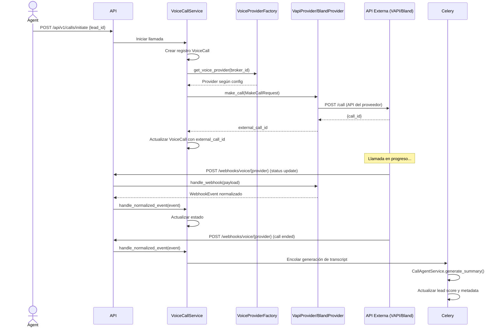

# UC-05: Iniciar Llamada de Voz

## Descripción

Un agente o el sistema inicia una llamada telefónica a un lead usando IA de voz. El proveedor de voz se selecciona según la configuración del broker.

## Actor Principal

Agent, Admin, Sistema (campaña)

## Precondiciones

- Lead existe con número de teléfono válido
- Proveedor de voz configurado para el broker (VAPI o Bland AI)
- API key del proveedor válida
- Phone number ID configurado (VAPI)

## Flujo Principal

1. Agente envía `POST /api/v1/calls/initiate` con `lead_id`
2. Se crea registro `VoiceCall` con `status=INITIATED`
3. La factory resuelve el proveedor según config del broker
4. El proveedor realiza la llamada vía su API
5. Se guarda `external_call_id` en el registro
6. Webhooks llegan con actualizaciones de estado
7. Se normalizan a `WebhookEvent` genérico
8. Al completar la llamada, se encola tarea de transcript/summary

## Flujos Alternativos

| ID | Condición | Acción |
|----|-----------|--------|
| FA-1 | Proveedor no disponible | Retornar 503 |
| FA-2 | Teléfono inválido | Retornar 400 |
| FA-3 | Llamada no contestada | Webhook con status NO_ANSWER |
| FA-4 | Llamada fallida | Webhook con status FAILED, log error |

## Postcondiciones

- VoiceCall record creado y actualizado
- Transcripción generada (si la llamada fue contestada)
- Resumen de IA generado
- Score del lead actualizado
- Actividad registrada
