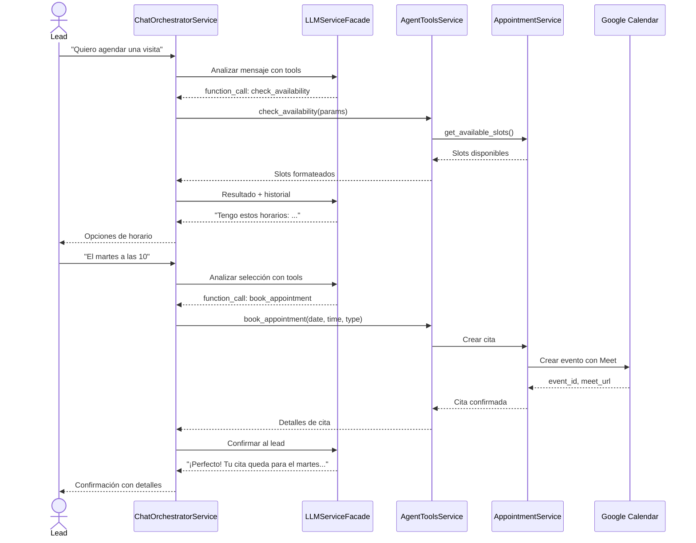

# UC-07: Agendar Cita

## Descripción

Se agenda una cita entre un lead y un agente, ya sea manualmente por un agente o automáticamente a través del chat con IA (function calling).

## Actor Principal

Agent, Lead (vía chat IA)

## Precondiciones

- Lead existe en el sistema
- Agente tiene disponibilidad configurada
- Google Calendar integrado (opcional)

## Flujo Principal - Agendamiento Manual

1. Agente consulta slots disponibles: `GET /appointments/available/slots?start_date=...&end_date=...&agent_id=...`
2. El sistema verifica `AvailabilitySlots` menos `Appointments` y `AppointmentBlocks` existentes
3. Agente crea cita: `POST /appointments` con `{lead_id, appointment_type, start_time, agent_id}`
4. El sistema calcula `end_time` según `duration_minutes`
5. Si Google Calendar está configurado, crea evento con link de Google Meet
6. Retorna cita con `status=SCHEDULED` y `meet_url`

## Flujo Principal - Agendamiento vía Chat IA

## Tipos de Cita

| Tipo | Descripción |
|------|-------------|
| `PROPERTY_VISIT` | Visita a propiedad |
| `VIRTUAL_MEETING` | Reunión virtual (Meet) |
| `PHONE_CALL` | Llamada telefónica |
| `OFFICE_MEETING` | Reunión en oficina |
| `OTHER` | Otro |

## Flujos Alternativos

| ID | Condición | Acción |
|----|-----------|--------|
| FA-1 | Sin slots disponibles | Sugerir otros horarios/fechas |
| FA-2 | Google Calendar no configurado | Crear cita sin meet_url |
| FA-3 | Conflicto de horario | Retornar 409 |
| FA-4 | Lead cancela | `POST /appointments/{id}/cancel` con razón |

## Postcondiciones

- Appointment creado con `status=SCHEDULED`
- Evento en Google Calendar (si configurado) con link Meet
- Lead movido a etapa "agendado" en pipeline
- Actividad registrada
